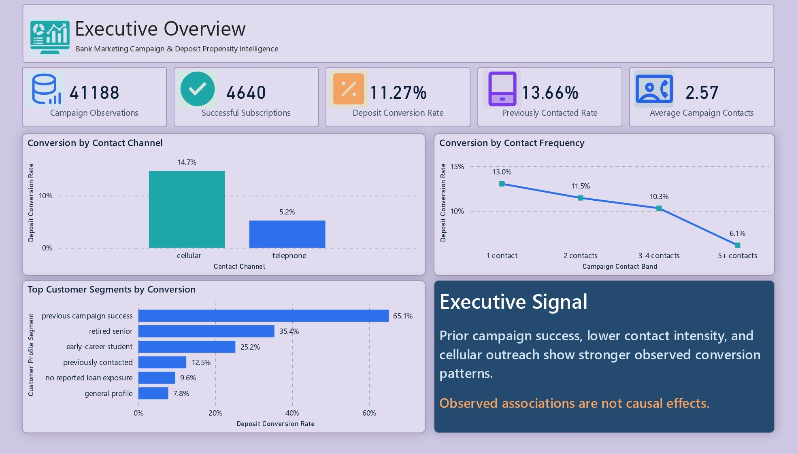
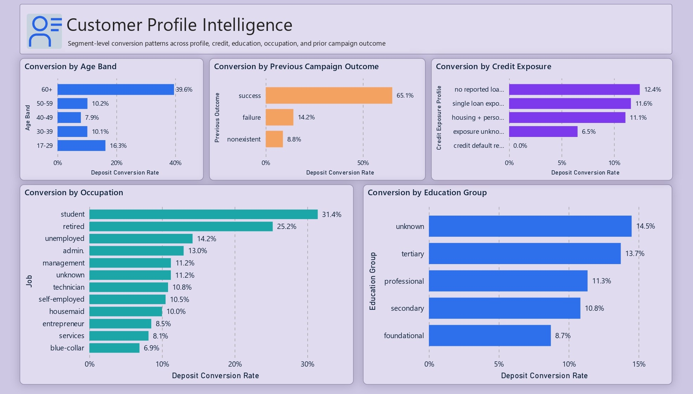
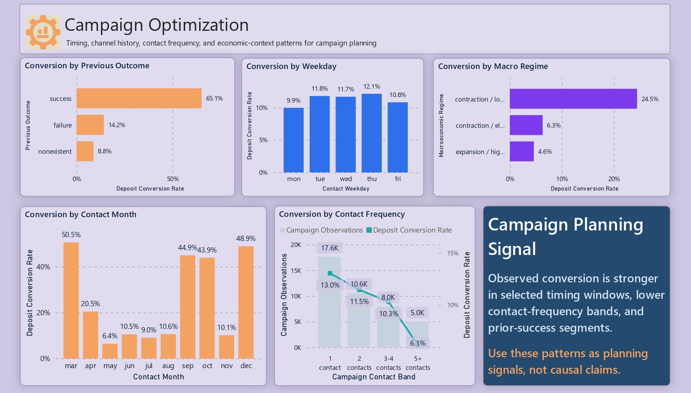
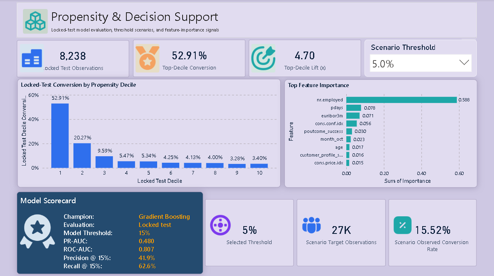
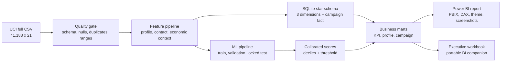
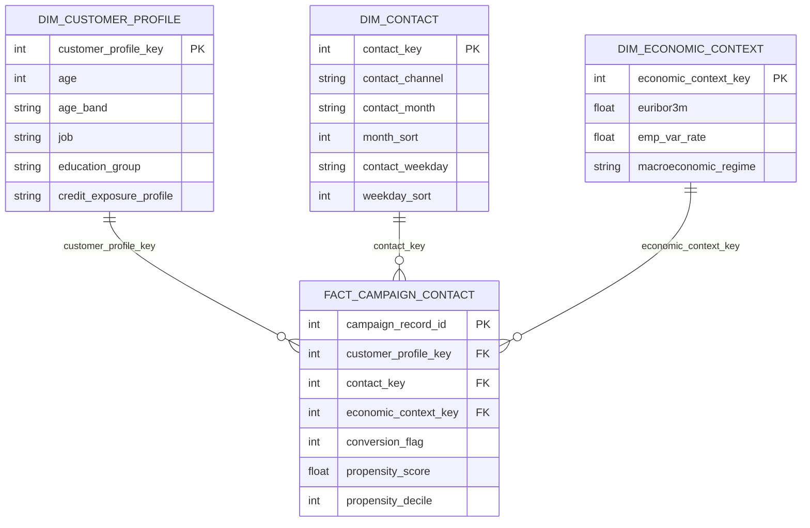

# Bank Marketing Campaign & Deposit Propensity Intelligence

An end-to-end banking Business Intelligence and predictive analytics platform that turns 41,188 UCI Bank Marketing campaign observations into governed data, a SQLite star schema, executive reporting, and leakage-safe propensity decision support.

> **Portfolio scope:** term-deposit acquisition analytics. Each row is a campaign observation, not a verified unique customer. The project makes no unsupported revenue, ROI, CAC, CLV, retention, or portfolio-growth claims.

## Live Demo

<!-- STREAMLIT-LIVE-START -->
Live Streamlit deployment is pending. Replace this line with the validated public URL after deployment.
<!-- STREAMLIT-LIVE-END -->

## Executive Summary

The campaign produced 4,640 term-deposit subscriptions from 41,188 observations, an observed conversion rate of **11.27%**. Cellular observations converted at **14.74%** versus **5.23%** for telephone, while a successful previous campaign outcome was associated with **65.11%** conversion. Conversion fell from **13.03%** at one current-campaign contact to **6.11%** at five or more contacts.

A calibrated Gradient Boosting propensity model, built without post-call `duration`, achieved locked-test **PR-AUC 0.480**, **ROC-AUC 0.807**, **62.6% recall**, and **41.9% precision** at a validation-selected threshold of 0.150. The highest locked-test propensity decile converted at **52.9%**, producing **4.70x lift** over the test base rate.

## Portfolio-Ready Dashboard Preview

The Lavender Slate canvas (`#CEC8E3`) is intentionally non-white so each image remains distinct and readable when embedded on either white or dark-navy portfolio pages.

### Executive Overview



### Customer Profile Intelligence



### Campaign Optimization



### Propensity & Decision Support



## Business Problem

Marketing leaders need to understand campaign performance, select defensible profile priorities, manage contact intensity, and allocate outreach capacity. This platform answers those questions while preserving source grain, preventing prediction leakage, and separating observed facts from predictive and recommended actions.

## Architecture



## Data Model



**Fact grain:** one row per source campaign observation. `campaign_record_id` is a technical surrogate and is never interpreted as a customer identifier.

`model_evaluation_decile` is a disconnected locked-test aggregate used only for unbiased propensity-decile evaluation. Operational scores remain in the campaign fact for ranking scenarios and are never substituted for locked-test performance.

## Data Quality and Governance

| Control | Verified result | Decision |
|---|---:|---|
| Source shape | 41,188 rows x 21 columns | Exact contract |
| Native null cells | 0 | No nulls introduced |
| Exact duplicate excess rows | 12 | Retained and flagged |
| `pdays = 999` | 39,673 | Retained as sentinel |
| Positive target | 4,640 / 11.27% | Stratified modeling |
| Raw SHA-256 | `74adfc578bf77a7ff4bb1ba4a9f8709d9e3c6907342959c2c8416847e0afb4d8` | Reproducible manifest |

`unknown` values are audited as explicit source categories rather than treated as nulls. Outliers are profiled and retained unless there is evidence of invalidity. See [data quality](outputs/reports/data_quality_report.md), [dictionary](outputs/reports/data_dictionary.md), and [reconciliation](outputs/reports/source_to_target_reconciliation.md).

## Machine Learning Methodology

- Target: `y = yes` term-deposit subscription
- Models: Logistic Regression, Random Forest, Gradient Boosting
- Split: 60% train, 20% validation, 20% locked test
- Cross-validation: three-fold stratified CV on training data
- Selection: validation PR-AUC, not accuracy
- Calibration: sigmoid calibration
- Threshold: validation maximum F2, emphasizing recall
- Leakage control: `duration` explicitly excluded from all production features
- Model outputs: score, decile, priority tier, recommendation flag, split label

| Model | CV PR-AUC | Validation PR-AUC | Validation ROC-AUC |
|---|---:|---:|---:|
| Logistic Regression | 0.443 | 0.440 | 0.797 |
| Random Forest | 0.457 | 0.461 | 0.800 |
| **Gradient Boosting** | **0.456** | **0.463** | **0.799** |

The champion is selected on the validation metric; locked-test results are reported only after selection. **All evaluation decile charts and lift metrics use the locked test set only.** Full-portfolio scores are operational ranking outputs and are labeled separately. See the [model card](outputs/reports/model_card.md) and [governance report](outputs/reports/model_governance.md).

## Executive KPIs

The analytical layer supports campaign observations, subscriptions, conversion rate, average and median contacts, previously contacted rate, previous success rate, channel conversion, profile conversion, timing performance, contact-frequency performance, economic regime, high-propensity count, top-decile conversion, and lift.

No financial KPI is calculated because the source contains no campaign cost, revenue, or profit fields.

## Decision Support

1. Use locked-test top-decile lift as model evidence; use operational score tiers to sequence historical targeting scenarios.
2. Prefer cellular where customers are operationally eligible, but confirm incremental channel impact through randomized holdouts.
3. Apply a conservative contact cap and investigate the observed drop after repeated contact.
4. Treat 0.150 as a configurable capacity threshold, not a permanent policy.
5. Require minimum profile volume and subgroup performance review before deployment.

See the full [business recommendations](docs/business_recommendations.md).

## Power BI Package

The `powerbi/` folder contains:

- Native Power BI report: `Bank_Marketing_Intelligence.pbix`
- Four presentation-ready Power BI screenshots in `powerbi/screenshots/`
- One governed Lavender Executive theme JSON with no pure-white report canvas
- Traceable DAX measure dictionary

The report uses a star schema, disconnected locked-test model evaluation, and a separate scenario threshold table so descriptive slicers and model evidence remain clearly separated.

## Streamlit Companion

`app.py` provides a deployable executive companion with descriptive filters, locked-test propensity evaluation, operational threshold scenarios, PSI drift monitoring, calibration, and subgroup performance. A visible sidebar control switches the complete dashboard between curated Lavender Slate and Midnight Navy appearances. It complements Power BI and does not replace the required `.pbix`.

Run locally:

```powershell
python -m streamlit run app.py
```

## Analytical Notebooks

The notebook layer is organized as a concise review sequence and consumes governed pipeline outputs rather than creating competing transformation logic:

1. `01_data_quality_and_campaign_eda.ipynb` - source health, unknown-category audit, and descriptive campaign analysis.
2. `02_propensity_model_validation.ipynb` - model selection, locked-test evidence, drift, calibration, and subgroup diagnostics.
3. `03_executive_intelligence_review.ipynb` - executive KPI and decision-support narrative.

## Executive Workbook

`Bank_Marketing_Intelligence_Executive_Workbook.xlsx` is a portable companion for reviewers without Power BI. It includes four executive analysis sheets, native Excel charts, formula-driven conversion rates, KPI and data dictionaries, and a filterable source sample.

## Reproduce

```powershell
Set-Alias python "C:\Users\Asus\AppData\Local\Programs\Python\Python311\python.exe"
python --version
python -m pip install -r requirements.txt
python run_project.py
python -m pytest
python -m streamlit run app.py
```

For a presentation-only refresh using existing trained artifacts:

```powershell
$env:BANK_INTELLIGENCE_REUSE_MODEL_OUTPUTS = "1"
python run_project.py
```

## Repository Structure

```text
data/raw/                    Immutable full source CSV
data/processed/              Feature-complete and Power BI extracts
app.py                       Streamlit executive companion
src/bank_intelligence/       Quality, features, analytics, modeling, SQL, reporting
sql/                         DDL, star load, marts, validation
models/                      Serialized calibrated champion
powerbi/                     Native PBIX, theme, DAX dictionary, and Power BI screenshots
outputs/                     SQLite DB, analytical previews, reports, scores, run manifest
tests/                       Data, SQL, ML evaluation, governance, and app tests
notebooks/                   Three-stage Python 3.11 analytical review
docs/                        Business recommendations only
```

## Dataset Limitations

- No unique customer ID or verified customer-level history
- No transaction, balance, revenue, cost, profit, churn, or retention data
- No complete date or year field
- Observational campaign data cannot establish causality
- Propensity is not creditworthiness and must not be used for adverse decisions

## Source

UCI Machine Learning Repository, [Bank Marketing dataset](https://archive.ics.uci.edu/dataset/222/bank+marketing). Only `bank-additional-full.csv` is used.